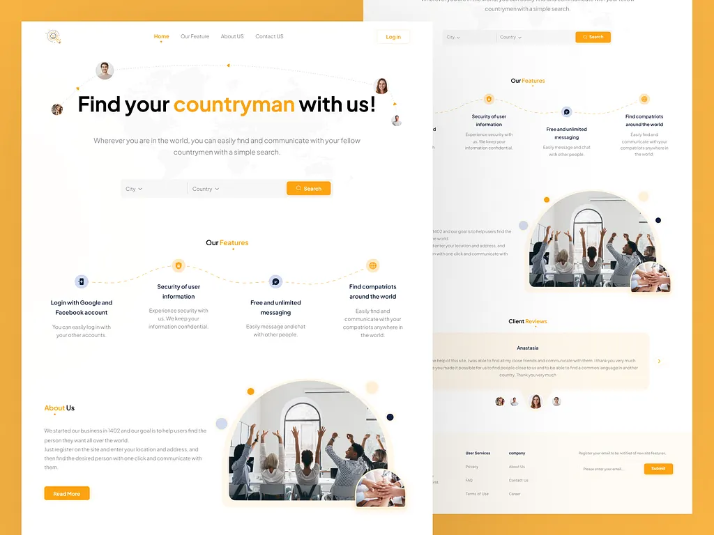

# Countryman Finder 🌍

A modern responsive web application that helps users find and connect with fellow countrymen around the world through a fast and intuitive search system.

---

## 🚀 Live Demo

👉 https://countryman-finder.netlify.app

---

## 📌 Project Overview

Countryman Finder is a frontend web application that simulates a global networking platform. Users can search for people from the same country, view profiles, and interact with structured user data efficiently.

This project demonstrates practical skills in modern React development, including component-based architecture, API integration, state management, and responsive UI design.

---

## 🛠️ Tech Stack

- React
- Vite
- Bootstrap
- React Router
- Axios
- Context API
- Redux
- Local Storage
- REST API
- Lazy Loading
- Suspense
- Skeleton Loading UI

---

## ✨ Features

- 🌍 Fully Responsive Design (Mobile / Tablet / Desktop)
- 🔎 Advanced Search System
- 📄 Pagination
- 🎛️ Filtering & Sorting
- 🔐 Authentication Flow (Frontend Simulation)
- ⚡ REST API Integration (mockapi.io)
- ⏳ Skeleton Loading States
- ❌ Error Handling
- 💾 Persistent State with Local Storage
- ⚙️ Scalable Component Architecture

---

## 🌐 API Integration

This project uses a mock REST API:

https://68f17b88b36f9750dee96c75.mockapi.io/reviews

---

## 📸 Screenshots

### 🏠 Home Page


---

## 📁 Project Structure

```
src/
├── components/
├── pages/
├── assets/
├── context/
├── redux/
├── services/
├── hooks/
└── App.jsx
```

---

## ⚙️ Getting Started

Clone the repository:

```bash
git clone https://github.com/ZahraShourmeij/Countryman-finder.git
```

Install dependencies:

```bash
npm install
```

Run the development server:

```bash
npm run dev
```

---

## 📦 Production Build

```bash
npm run build
```

---

## 🎯 Project Purpose

This project was built as a portfolio piece to demonstrate:
- Practical React skills
- API integration and asynchronous data handling
- State management using Redux and Context API
- Real-world UI/UX patterns and responsiveness

---

## 👩‍💻 Author

**Zahra Shourmeij**
